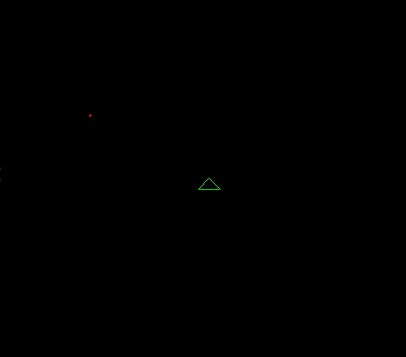



## Spaceship \(using trig\)

### Description

This is an example i made that uses trig to draw and move a space ship (actually a isoceles triangle), and uses custom types for the 'ship'.

this is a must see code, as it is quite short and simple. i've commented as much i could so it should make sense. please rate it and feel free to leave comments.
 
### More Info
 

             |
---                |---
**Submitted On**   |2003-07-30 16:13:58
**By**             |[Brian\_A ](https://github.com/Planet-Source-Code/PSCIndex/blob/master/ByAuthor/brian-a.md)
**Level**          |Beginner
**User Rating**    |4.0 (8 globes from 2 users)
**Compatibility**  |VB 6\.0
**Category**       |[Games](https://github.com/Planet-Source-Code/PSCIndex/blob/master/ByCategory/games__1-38.md)
**World**          |[Visual Basic](https://github.com/Planet-Source-Code/PSCIndex/blob/master/ByWorld/visual-basic.md)
**Archive File**   |[Spaceship\_1621797302003\.zip](https://github.com/Planet-Source-Code/brian-a-spaceship-using-trig__1-47271/archive/master.zip)

